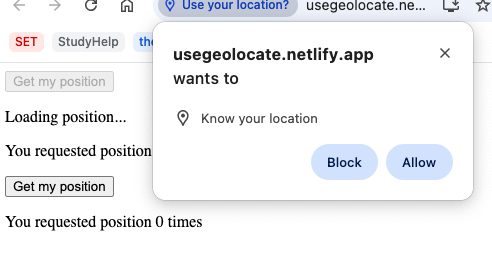

# useGeolocate

## Table of contents

- [Overview](#overview)
  - [The challenge](#the-challenge)
  - [Screenshot](#screenshot)
  - [Links](#links)
- [My process](#my-process)
  - [Built with](#built-with)
  - [What I learned](#what-i-learned)
  - [Continued development](#continued-development)
- [Author](#author)

## Overview

### The challenge

Users should be able to:

- View the optimal layout for the app depending on their device's screen size
- With browser permission, see your current longitude and latitude coordinates

### Screenshot

### Links

- Live Site URL: [View](https://usegeolocate.netlify.app/)

## My process

- In this app, the user inputs an amount and selects two currencies to convert between.
- The app uses the Frankfurter API to fetch the exchange rate based on the selected currencies and input amount.
- When the user changes the input amount or selects different currencies, the `useEffect` hook triggers the `fetchConvert` function to make an API request.
- The API response provides the exchange rate, which is then used to calculate the converted value.
- The result is displayed in the output component, showing the converted amount along with the target currency.
- The app consists of three main parts: input, currency selection, and output, all managed with state variables for dynamic updates.

### Built with

- Semantic HTML5 markup
- CSS custom properties
- Mobile-Responsive Design
- JavaScript - Scripting language
- [React](https://reactjs.org/) - JS library

### What I learned

This was a class project to learn about custom hooks.

### Continued development

maybe use later

## Author

- Website - [Cameron Howze](https://camkol.github.io/)
- Frontend Mentor - [@camkol](https://www.frontendmentor.io/profile/camkol)
- GitHub- [@camkol](https://github.com/camkol)
- LinkedIn - [@cameron-howze](https://www.linkedin.com/in/cameron-howze-28a646109/)
- E-Mail - [cameronhowze4@outlook.com](mailto:cameronhowze4@outlook.com)
